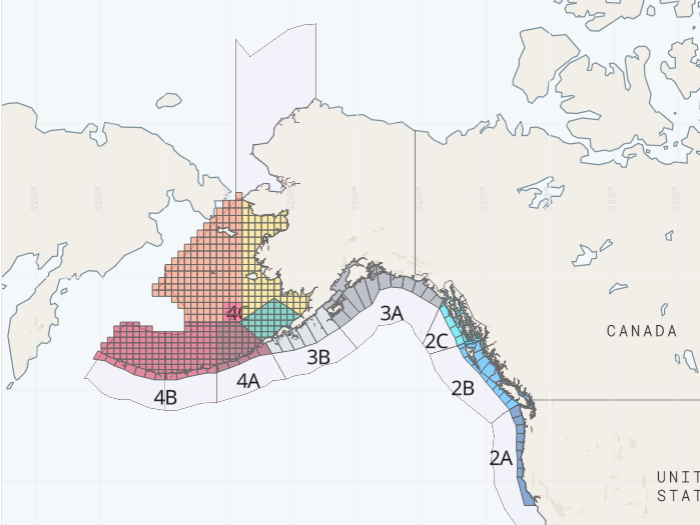
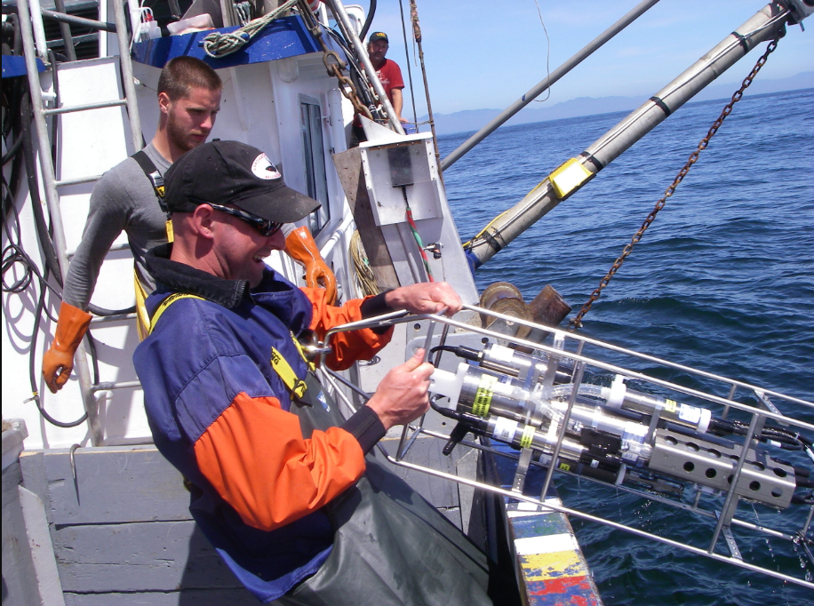
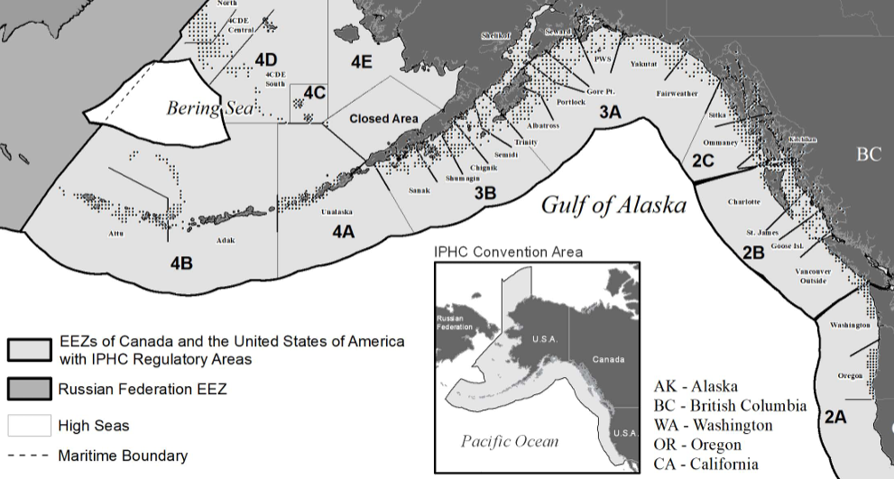

```{r, echo=FALSE}
# assign working directory to variable
directory <- "___"
```

# Predicting Pacific Halibut Catch and Landings in the Gulf of Alaska

Historically, one of the most valuable commercial and recreational fisheries in the Gulf of Alaska has been the Pacific Halibut (Hippoglossus stenolepis), which ranges from the coast of California up through the Aleutian Island chain in Alaska. Jointly managed by the United States and Canada through the International Pacific Halibut Commission (IPHC), the status and catch of this species are closely monitored, and divided into ten Regulatory Areas, seven of which are located in the state of Alaska.

<center>



</center>

Due to its economic importance to the region, concerns are rising about the sustainability of the stock and how management agencies can mitigate the impact of climate change on this species. In the past decade, the stock has been in a slow decline from historical levels, for reasons that have not been fully identified by stock assessment scientists.

<center>

{width="80%"}

</center>

We propose a solution that aims to predict future catch and landings of Pacific Halibut using a long-term dataset of environmental variables collected by the IPHC from these Regulatory Areas and applying similarity-based learning techniques. By leveraging a weighted k-Nearest Neighbors (k-NN) model, the goal is to develop a predictive capacity for local communities to foresee changes in the fishery in response to environmental shifts (e.g., rising sea temperatures). Such a model could also provide an evidentiary basis for funding and permissions to install permanent, stationary at-sea monitoring systems throughout the fishing grounds. These monitoring systems would support short-term predictive capacity and real-time ground-truthing of the model, while also informing IPHC management efforts regarding which Regulatory Areas may require closer attention due to the impacts of climate change.


```{r setup}
knitr::opts_chunk$set(echo = TRUE)

# load necessary libraries
library(dplyr)
library(tidyr)
```

## Data Set Exploration

The IPHC provides a substantial long-term datasets from which to develop and train the model. This includes both catch and environmental data, which are comprehensive and publicly available in .csv format.

### Water Column Profiler Data

The IPHC conducts an annual stock assessment survey using a standardized grid implemented for decades (Figure 2). At each sampling station, a water column profiler is deployed to collect data on depth, temperature, salinity, dissolved oxygen, pH, and chlorophyll-a concentrations. The dataset is organized by year and station, with divisions by regulatory area, dating back consistently to 2009.

- Data Source: [IPHC Water Column Profiler Data] (https://www.iphc.int/data/water-column-profiler-data/)

<center>



</center>

```{r}
# import raw water column profiler data, replace nulls with na

iphc2009 <- read.csv("iphc2009.csv", na.strings="null", header=TRUE)
iphc2010 <- read.csv("iphc2010.csv", na.strings="null", header=TRUE)
iphc2011 <- read.csv("iphc2011.csv", na.strings="null", header=TRUE)
iphc2012 <- read.csv("iphc2012.csv", na.strings="null", header=TRUE)
iphc2013 <- read.csv("iphc2013.csv", na.strings="null", header=TRUE)
iphc2014 <- read.csv("iphc2014.csv", na.strings="null", header=TRUE)
iphc2015 <- read.csv("iphc2015.csv", na.strings="null", header=TRUE)
iphc2016 <- read.csv("iphc2016.csv", na.strings="null", header=TRUE)
iphc2017 <- read.csv("iphc2017.csv", na.strings="null", header=TRUE)
iphc2018 <- read.csv("iphc2018.csv", na.strings="null", header=TRUE)
```

### Pacific Halibut Landings Data

The IPHC records annual landings for Pacific Halibut by year and Regulatory Area, with records spanning over 100 years.

- Data Source: [IPHC Time Series Datasets](https://www.iphc.int/data/time-series-datasets/

<center>



</center>

```{r}
# import raw landings data, replace nulls with na

landings <- read.csv("iphc_annual_landings.csv", header=TRUE)
```

### Cleaning Up the Datasets

The first step is to bind all of the raw data .csvs into a single dataframe.

Number of observations: 1,674,765

Number of variables: 20

```{r}
# bind all .csvs into a single data frame

profiler_data <- rbind(iphc2009, iphc2010, iphc2011, iphc2012, iphc2013, iphc2014, iphc2015, iphc2016, iphc2017, iphc2018)

summary(profiler_data)
```

Now that dataframe can be filtered and manipulated, only the variables necessary to train and test the model are retained. 

Number of observations: 583,060

Based on the summary information, some of the records are not realistic (e.g. a pH of higher than 14), so they are likely data errors. First, we narrow the data frame down to the variables that are necessary for the training data, and then filter those variables into reasonable ranges.

Number of observations: 490,884

```{r}
# select only necessary columns, filter to only top 50m of water column, filter environmental variables to reasonable ranges

profiler_data <- profiler_data %>%
  select(year, stnno, pres_db, temp_c, oxygen_ml, pH, chlorophyll, salinity_PSU, RegArea) %>%
  filter(
    pres_db >=2,
    pH >= 0 & pH <= 14,
    chlorophyll >= 0
  )
  
summary(profiler_data)
```

Now that the variable have been reduced to reasonable ranges, we look at the distribution of the data to try and identify where more cleanup is needed.

```{r}
hist(profiler_data$pres_db)
hist(profiler_data$temp_c)
hist(profiler_data$oxygen_ml)
hist(profiler_data$pH)
hist(profiler_data$chlorophyll)
hist(profiler_data$salinity_PSU)
```

Based on the histograms, it appears as though there are many outlier values in some of the variables.Because this data is collected by oceanographic equipment, it is likely that that outliers are due to instrument calibration issues. We will remove them using an IQR-based outlier removal method.

This is also important because we intend to use a kNN method, which is distance-based and therefore very sensitive to outliers.

Number of observations: 337,265

```{r}
# Function to calculate IQR-based outlier bounds
remove_outliers <- function(x) {
  q1 <- quantile(x, 0.25, na.rm = TRUE)
  q3 <- quantile(x, 0.75, na.rm = TRUE)
  iqr <- q3 - q1
  lower <- q1 - 1.5 * iqr
  upper <- q3 + 1.5 * iqr
  x >= lower & x <= upper
}

# Remove outliers from multiple variables
profiler_data <- profiler_data %>%
  filter(
    remove_outliers(pres_db) &
    remove_outliers(temp_c) &
    remove_outliers(oxygen_ml) &
    remove_outliers(chlorophyll) &
    remove_outliers(salinity_PSU)
  )
```

When we look at the histograms again, the distribution of the data is much closer to the expected distributions.

```{r}
hist(profiler_data$pres_db)
hist(profiler_data$temp_c)
hist(profiler_data$oxygen_ml)
hist(profiler_data$pH)
hist(profiler_data$chlorophyll)
hist(profiler_data$salinity_PSU)
```

Now the data is ready to average out by year, station, and variable to be used for training and testing the model.

Number of observations: 8987

```{r}
# average oceanographic variables by year and station

profiler_avg <- profiler_data %>%
  group_by(year, stnno, RegArea) %>%
  summarize(
    avg_temp = mean(temp_c, na.rm = TRUE),
    avg_oxy = mean(oxygen_ml, na.rm = TRUE),
    avg_chloro = mean(chlorophyll, na.rm = TRUE),
    avg_salin = mean(salinity_PSU, na.rm = TRUE),
    .groups = "drop"
  ) 
head(profiler_avg)
```


Next the dependent variable dataset needs some re-organizing before it can be combined with the environmental variable dataframe.

Variable names beginning with numbers are not compatible in RStudio, so the column names that came with the original data need to be temporarily adjusted to have the letter first, and the Areas in the water column profiler data need to be temporarily set to match.

```{r}
# rename landings columns

landings <- landings %>%
  rename(
    A2 = X2A,
    B2 = X2B,
    C2 = X2C,
    A3 = X3A,
    B3 = X3B,
    A4 = X4A,
    B4 = X4B
  )

# re-categorize RegArea value to match columns in landings data to prep for join

profiler_avg <- profiler_avg %>%
  mutate(RegArea = case_when(
    RegArea == "2A" ~ "A2",
    RegArea == "2B" ~ "B2",
    RegArea == "2C" ~ "C2",
    RegArea == "3A" ~ "A3",
    RegArea == "3B" ~ "B3",
    RegArea == "4A" ~ "A4",
    RegArea == "4B" ~ "B4",
    TRUE ~ RegArea  # Keeps other values unchanged
  )
)
head(profiler_avg)

```

Now we can combine the data frames.

Number of observations: 8987

```{r}
# reshape landings data to long format and join data frames
landings_pivot <- landings %>%
  pivot_longer(cols = -Year, names_to = "RegArea", values_to = "annual_landings")

iphc_fulldataset <- profiler_avg %>%
  left_join(landings_pivot, by = c("year" = "Year", "RegArea"))

head(iphc_fulldataset)
```

The designations of the Regulatory Areas can now be returned back to normal. Only observations with specific regulatory areas specifed are retained.

Number of observations: 8454

```{r}
# return RegArea designations back to original coding

iphc_fulldataset <- iphc_fulldataset %>%
  mutate(RegArea = case_when(
    RegArea == "A2" ~ "2A",
    RegArea == "B2" ~ "2B",
    RegArea == "C2" ~ "2C",
    RegArea == "A3" ~ "3A",
    RegArea == "B3" ~ "3B",
    RegArea == "A4" ~ "4A",
    RegArea == "B4" ~ "4B"
  ))

iphc_fulldataset_full_depth <- iphc_fulldataset %>%
    filter(RegArea %in% c("2A", "2B", "2C", "3A", "3B", "4A", "4B"))

head(iphc_fulldataset_full_depth)
```

Save file as a .csv so that it can be used to train and test the kNN model.

```{r}
# save as a .csv

write.csv(iphc_fulldataset_full_depth, directory, row.names=FALSE)
```

